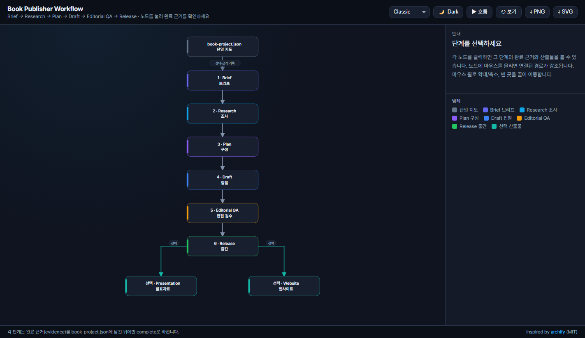
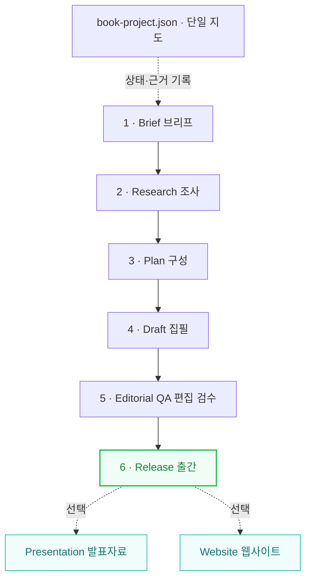

# Book Publisher Workflow

책의 기획부터 집필, 편집 검수, 출간 파일 제작까지 AI와 함께 운영하기 위한 공개 워크플로우 스킬입니다. 원고를 한 번 생성하는 프롬프트가 아니라, 프로젝트 상태와 완료 근거를 남기며 다음 단계로 이동하는 작업 체계를 제공합니다.

## 워크플로우 한눈에 보기

<a href="https://tigerjk9.github.io/book-publisher-workflow/"><b>▶ 인터랙티브 도식 열기</b></a> — 각 단계를 눌러 완료 근거(evidence)를 확인하고, 마우스 호버로 경로를 추적하며, 테마·프리셋(Classic·Signal Flow·Blueprint) 전환과 PNG/SVG 내보내기를 지원합니다. <a href="https://github.com/tt-a1i/archify">archify</a>(MIT) 아이디어를 기반으로 만든 완전 자립 HTML이며, 소스는 <a href="assets/workflow-viz/">assets/workflow-viz/</a>에 있습니다.

각 단계는 완료 근거(evidence)를 남긴 뒤에만 다음으로 이동합니다. `book-project.json`은 전 단계의 상태, 근거, 산출물 경로를 잇는 프로젝트의 단일 지도입니다. 이미지가 열리지 않아도 아래 도식은 항상 표시됩니다.

## 제공하는 것

- 독자·목적·문체·출간 경로를 먼저 확정하는 프로젝트 브리프
- 조사, 구성, 집필, 편집 QA, 릴리스의 6단계 완료 게이트
- 여러 장의 원고를 유지하기 위한 이식 가능한 book-project.json
- 새 프로젝트 초기화와 구조 검증을 위한 Python 표준 라이브러리 스크립트
- 선택형 발표자료와 책 웹사이트 제작 기준
- Codex와 Claude Code에서 함께 사용할 수 있는 표준 SKILL.md

이 저장소에는 특정 저자의 원고, 개인 URL, API 키, 배포 토큰, 로컬 절대 경로가 포함되지 않습니다.

## 설치

### Codex

이 저장소를 내려받은 뒤 skills/book-publisher 디렉터리를 사용자의 Codex 스킬 디렉터리에 복사합니다. 아래 명령은 기존 설치가 없는 신규 설치용입니다.

macOS/Linux:

~~~bash
mkdir -p ~/.codex/skills
test ! -e ~/.codex/skills/book-publisher || { echo "Existing skill found; back it up before updating."; exit 1; }
cp -R skills/book-publisher ~/.codex/skills/book-publisher
~~~

PowerShell:

~~~powershell
New-Item -ItemType Directory -Force "$HOME/.codex/skills" | Out-Null
if (Test-Path "$HOME/.codex/skills/book-publisher") { throw "Existing skill found; back it up before updating." }
Copy-Item -Recurse "skills/book-publisher" "$HOME/.codex/skills/book-publisher"
~~~

### Claude Code

같은 디렉터리를 Claude Code 사용자 스킬 디렉터리에 복사합니다. 아래 명령도 기존 설치가 없는 신규 설치용입니다.

macOS/Linux:

~~~bash
mkdir -p ~/.claude/skills
test ! -e ~/.claude/skills/book-publisher || { echo "Existing skill found; back it up before updating."; exit 1; }
cp -R skills/book-publisher ~/.claude/skills/book-publisher
~~~

PowerShell:

~~~powershell
New-Item -ItemType Directory -Force "$HOME/.claude/skills" | Out-Null
if (Test-Path "$HOME/.claude/skills/book-publisher") { throw "Existing skill found; back it up before updating." }
Copy-Item -Recurse "skills/book-publisher" "$HOME/.claude/skills/book-publisher"
~~~

### 기존 설치 업데이트

기존 폴더 위에 새 파일을 합치지 마십시오. 먼저 기존 book-publisher 폴더를 날짜가 붙은 백업 이름으로 옮긴 뒤, 위의 신규 설치 명령으로 새 폴더를 복사합니다. 새 버전을 확인한 후에만 백업을 삭제하십시오.

macOS/Linux 예시:

~~~bash
mv ~/.codex/skills/book-publisher ~/.codex/skills/book-publisher.backup
cp -R skills/book-publisher ~/.codex/skills/book-publisher
~~~

Windows PowerShell 예시:

~~~powershell
Move-Item "$HOME/.codex/skills/book-publisher" "$HOME/.codex/skills/book-publisher.backup"
Copy-Item -Recurse "skills/book-publisher" "$HOME/.codex/skills/book-publisher"
~~~

Claude Code는 위 경로의 .codex를 .claude로 바꾸어 같은 방식으로 업데이트합니다.

### Skills CLI

공개 GitHub 저장소로 배포한 뒤에는 Skills CLI의 저장소 설치 형식을 사용할 수 있습니다.

~~~bash
npx skills add tigerjk9/book-publisher-workflow
~~~

이 명령은 저장소의 `skills/` 아래에서 설치 가능한 스킬을 검색하는 형식입니다.

## 사용

AI에게 다음처럼 요청합니다.

~~~text
$book-publisher로 비개발자를 위한 실습서 프로젝트를 시작해 줘.
~~~

새 프로젝트를 직접 초기화할 수도 있습니다.

macOS/Linux:

~~~bash
python3 skills/book-publisher/scripts/init_project.py ./my-book --title "My Book" --language ko
python3 skills/book-publisher/scripts/validate_project.py ./my-book
~~~

Windows PowerShell:

~~~powershell
py -3 skills/book-publisher/scripts/init_project.py ./my-book --title "My Book" --language ko
py -3 skills/book-publisher/scripts/validate_project.py ./my-book
~~~

초기화 직후의 일반 검증은 프로젝트 구조를 확인합니다. 브리프의 자리표시자까지 모두 제거했는지 확인하려면 --strict를 추가합니다.

macOS/Linux:

~~~bash
python3 skills/book-publisher/scripts/validate_project.py ./my-book --strict
~~~

Windows PowerShell:

~~~powershell
py -3 skills/book-publisher/scripts/validate_project.py ./my-book --strict
~~~

## 프로젝트 구조

~~~text
my-book/
├── book-project.json
├── brief.md
├── manuscript/
├── research/
├── plan/
├── qa/
├── assets/
└── dist/
~~~

manuscript/가 원고의 기준본이며, dist/에는 그 기준본에서 만든 PDF·전자책·발표자료·웹 배포 파일을 둡니다.

## 설계 원칙

- AI가 완료를 주장하기 전에 파일과 검증 근거를 남깁니다.
- 집필과 검수를 분리합니다.
- 사용자가 편집한 원고를 생성본으로 덮어쓰지 않습니다.
- 외부 업로드와 배포는 사용자의 승인을 받은 시점에만 실행합니다.
- 발표자료와 웹사이트는 승인된 원고에서 파생합니다.

## 요구 사항

- Python 3.9 이상
- 초기화·검증 스크립트에는 외부 Python 패키지가 필요하지 않습니다.

## 라이선스

[MIT License](LICENSE)
